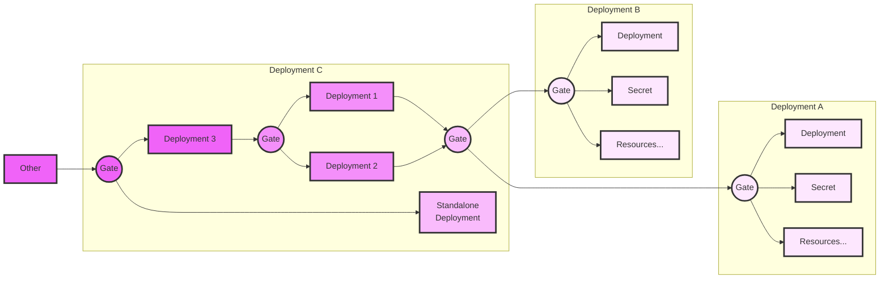

# Gate Operator

The Gate Operator solves a simple problem : orchestration among declarative kubernetes workloads.

## Why

Even though eventual consistency is a core principle of Kubernetes philosophy, it is not always achievable in a purely declarative way.

- One pod may start with default credentials before the said credentials could be retrieved. Leading to a soft lock of the pod.
- Another workload may create a LoadBalancer service before the load balancer controller was deployed. Leading to the usage of legacy controller and misconfiguration (Hello, EKS!)

Why is eventual consistency not always achievable is open to discussion. But, it is here and we need to deal with it.

## Solution

To solve this issue, tools exists. ArgoCd, per example, provide SyncWaves and Hooks. However, it is only applicable on the application scope or, more recently, on the ApplicationSet scope. It's a partial solution. 
In the same way, Helm provides char hooks. But, again, it's only usable in the chart scope.

These limitations make difficult to orchestrate larger workloads spread across multiple charts, applications, etc.

Enters Gate Operator with a simple yet powerful concept to synergize with deployment tools (Helm, etc)

## Concept

A Gate is a resource that have two possible state: opened or closed.

It changes state when its logicial expression is validated (then become opened) or invalidated (the become closed).

It has a logicial expression about resources in the cluster being in a certain way.

Per exemple:

- A gate may wait for a specific Deployment to be Available
- Or to wait for a ConfigMap to be created
- Or for another gate to be Opened (or Closed)

## Synergy

- Helm: a gate can be integrated in an application chart with the annotation `helm.sh/hook: pre-install` to prevent the creation of the chart resource before other resources are up and running.
- ArgoCD: same thing with Hook or SyncWaves. SyncWaves allows a gate to "pause" the deployment in the middle.