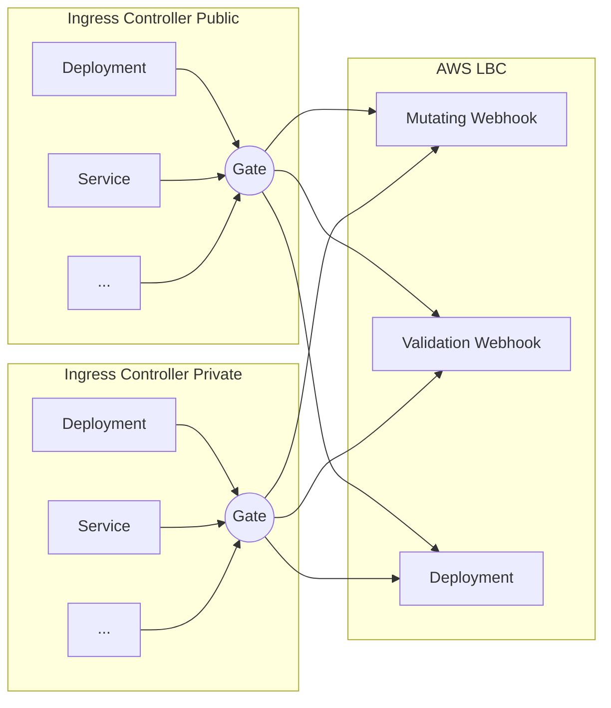
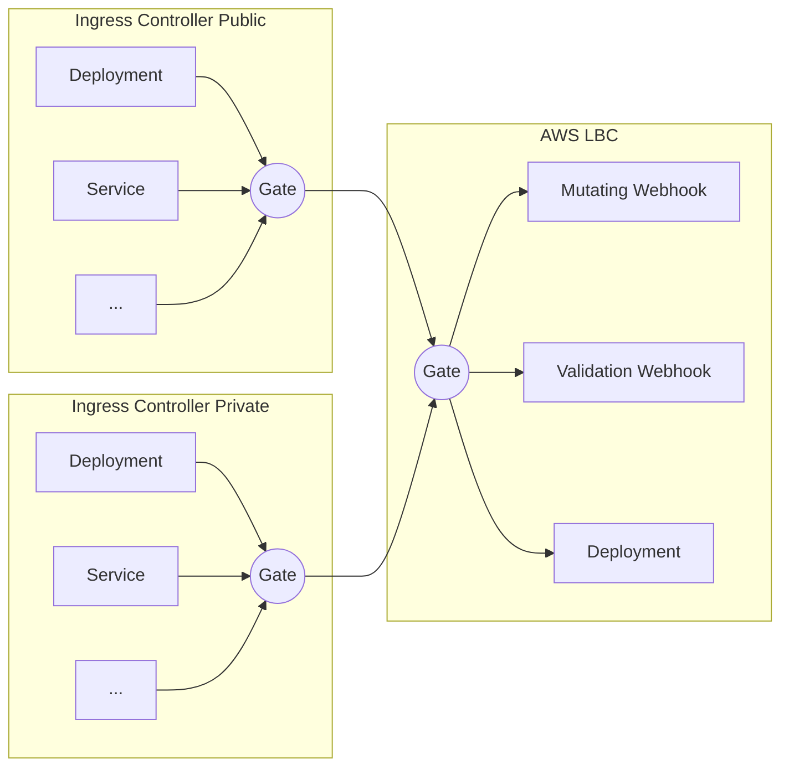

# Patterns

## Context example

On the front page, we talked about the AWS LoadBalancerController needed to be deployed before the services of type LoadBalancer on an EKS cluster.
If the order is not respected, the legacy LoadBalancer controller will take over and create Load Balancer that won't use the right annotations, ending up with a misconfigured load balancer.

## Front Gate pattern

We only need one gate to deploy in the same Chart or ArgoCD application with the right annotations.

The gate is coming in front of the deployment (by order):



This is a naive approach since it quickly causes a lot of duplicated configuration. Here is an example for one gate

```yaml
apiVersion: gate.sh/v1alpha1
kind: Gate
metadata:
  name: wait-for-aws-lbc
  namespace: my-app-namespace
  annotations:
    # For ArgoCD
    argocd.argoproj.io/hook: PreSync
    argocd.argoproj.io/hook-delete-policy: HookSucceeded
spec:
  targets:
    - selector:
        apiVersion: admissionregistration.k8s.io/v1
        kind: MutatingWebhookConfiguration
        name: aws-load-balancer-webhook

    - selector:
        apiVersion: admissionregistration.k8s.io/v1
        kind: ValidatingWebhookConfiguration
        name: aws-load-balancer-webhook
        
    - selector:
        apiVersion: apps/v1
        kind: Deployment
        name: aws-load-balancer-controller
        namespace: aws-load-balancer-controller
      validators:
        - matchCondition:
            type: Available
            status: !!str True
```


## Facade Gate pattern

This pattern works with the previous one, by creating a gate that opens only if the main
resources of the app are deployed. When this gate opens, the app is up. Other gates can detect it with a single reference.

Per example:



By adding a gate behind the app deployment (here the load balancer controller), we create an abstraction for other gate to select.

Here is a example for the AWS Load Balancer Controller gate:


```yaml
apiVersion: gate.sh/v1alpha1
# Here we use a ClusterGate since it's easier to refer and we have only one deployment of the LBC.
kind: ClusterGate
metadata:
  name: aws-lbc-ready
  annotations:
    # For ArgoCD
    argocd.argoproj.io/hook: PostSync
spec:
  targets:
    - selector:
        apiVersion: admissionregistration.k8s.io/v1
        kind: MutatingWebhookConfiguration
        name: aws-load-balancer-webhook

    - selector:
        apiVersion: admissionregistration.k8s.io/v1
        kind: ValidatingWebhookConfiguration
        name: aws-load-balancer-webhook
        
    - selector:
        apiVersion: apps/v1
        kind: Deployment
        name: aws-load-balancer-controller
        namespace: aws-load-balancer-controller
      validators:
        - matchCondition:
            type: Available
            status: !!str True
```

Then, in ingress controller deployments, we can have a gate like this :

```yaml
apiVersion: gate.sh/v1alpha1
kind: Gate
metadata:
  name: wait-for-aws-lbc
  namespace: my-app-namespace
  annotations:
    # For ArgoCD
    argocd.argoproj.io/hook: PreSync
    argocd.argoproj.io/hook-delete-policy: HookSucceeded
spec:
  targets:
    - selector:
        apiVersion: gate.sh/v1/alpha1
        kind: ClusterGate
        name: aws-lbc-ready
      validators:
        - matchCondition:
            type: Opened
```